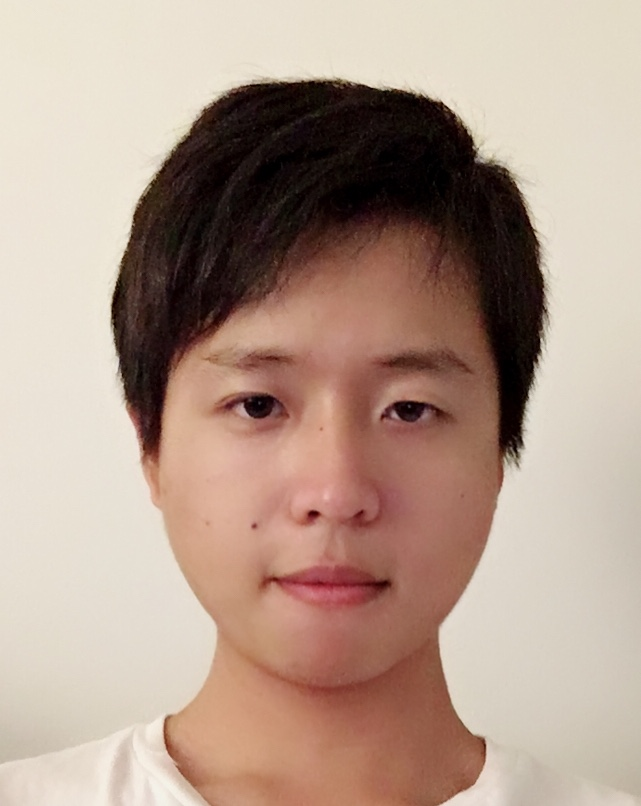

### Hello World!

I'm so excited to create my own webpage!

### Project Overview

This project focuses on building a personal website using Rmd files and site.yml on Rstudio, rendering them to corresponding html files, and hosting on github for public view. In addition, plots will be incorporated using the package *plotly*.

### Picture of Myself

### A little bit about myself

My name is Jianyou Liu (UNI: jl5296), a first year Biostatistics Masters student at Columbia University. I love data science and coding in R!!!